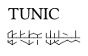

# trunic.typ

The video game *Tunic* (https://tunicgame.com) features a rune-like language called *Trunic*.
Most of the text in game is written in this language.

This library provides functions to easily write *Trunic* runes in a [Typst](https://typst.app) document.

> [!CAUTION]
> **Using this library requires that you understand how *Trunic* works.**
> 
> Since translating *Trunic* is one of the last puzzles of the game,
> **this library will effectively spoil you the solution of this puzzle**.
> 
> Thus, if you want to solve the puzzle by yourself, you should avoid reading the manual and using this library.

## Quick start

```typ
TUNIC \
#trunic("[REDACTED: Tunic spoilers]")
```


## Building from source

To build this library's manual, execute:
```sh
make manual
```
